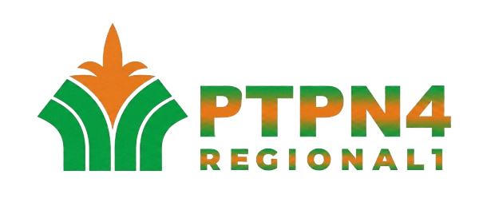

# SmartBook — BRM Quick Access Portal

<p align="center">
  
</p>

## Overview
**SmartBook** (BRM Quick Access Portal) adalah platform internal berbasis web yang dirancang sebagai pusat akses cepat (*quick access*) untuk Board of Regional Management (BRM). Website ini bertujuan untuk mempermudah akses ke berbagai website rutin perusahaan dan alat bantu AI dalam satu pintu yang modern, rapi, dan efisien.

## Fitur Utama
- **Dashboard Sederhana**: Navigasi intuitif untuk melihat ringkasan aplikasi.
- **Quick Access BRM**: Akses langsung ke website operasional (Monitoring, HR, Procurement, dll).
- **AI Tools**: Daftar alat bantu kecerdasan buatan (*AI*) yang sering digunakan (ChatGPT, Gemini, Canva, dll).
- **Pencarian & Filter**: Mempercepat pencarian aplikasi berdasarkan nama atau kategori.
- **Desain Corporate Modern**: Tampilan profesional, clean, dan responsif.

## Tech Stack
- **Backend**: Laravel 12
- **Frontend**: Tailwind CSS & Alpine.js
- **Icons**: Heroicons / Lucide Icons
- **Database**: MySQL

## Persiapan Instalasi
1. Clone repositori ini:
   ```bash
   git clone [url-repo]
   ```
2. Instal dependensi PHP & JS:
   ```bash
   composer install
   npm install && npm run build
   ```
3. Salin `.env.example` ke `.env` dan sesuaikan konfigurasi database.
4. Jalankan migrasi dan seeder:
   ```bash
   php artisan migrate --seed
   ```
5. Jalankan server lokal:
   ```bash
   php artisan serve
   ```

---

## Author
Proyek ini dikembangkan oleh: **[NAMA ANDA]**

Hubungi saya di:
- 📧 **Gmail**: [ahmadsyahlubis62@gmail.com](mailto:ahmadsyahlubis62@gmail.com)
- 📸 **Instagram**: [@ahmadsyah_62](https://instagram.com/ahmadsyah_62)
- 💼 **LinkedIn**: [ahmadsyahlubis](www.linkedin.com/in/ahmadsyahlubis)

---
*Dibuat untuk PTPN IV Regional I - Bagian TI*

